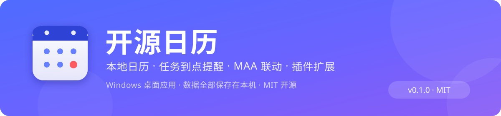

<p align="center">
  
</p>

<p align="center">
  <a href="https://github.com/tlmrt/-/releases/latest"></a>
  
  
  <a href="https://github.com/tlmrt/-/releases/latest"></a>
</p>

<h1 align="center">开源日历（EveCalendar）</h1>

<p align="center">
  Windows 桌面日历应用：在日历上按日期与时间安排任务，到点通过系统通知提醒你。<br>
  开源（MIT）· 可扩展（插件口）· 可联动（本地 HTTP API / MAA）· 全本地存储（隐私友好）
</p>

在日历上为每一天安排带具体时间的任务，到点自动弹系统通知；窗口最小化或藏在托盘也照常计时。UI 高度可定制：强调色/背景色、背景图片/图片幻灯片/视频背景、面板透明度，鼠标移出面板还能全屏看背景。

## 🚀 快速开始

1. 到 **[Releases](https://github.com/tlmrt/-/releases/latest)** 下载：
   - `开源日历 Setup x.y.z.exe` —— **安装版（推荐）**，自动创建桌面 / 开始菜单快捷方式
   - 便携版 —— 免安装，双击即用
2. 运行即可使用，**无需注册、无需联网**；数据全部保存在本机 `%APPDATA%\evestudio-calendar\`
3. 首次运行若 Windows 提示"已保护你的电脑"，点「更多信息 → 仍要运行」（暂未做代码签名）
4. **MAA 用户**：到「⚙ 设置 → 外部联动」点「**自动搜索 MAA**」一键定位路径，然后点日历右侧的 **🎮** 配置"一键长草"式任务队列

## ✨ 功能一览

- 📅 月视图日历：单击选日、双击该日新建任务；日期格内直接显示当天任务（时间+标题，优先级着色）
- ⏰ 任务：标题 / 日期 / 时间 / 备注 / 标签 / 优先级（低·中·高）
- 🔁 重复任务：每天 / 工作日 / 每周同一天 / 每月同一日（月末自动收敛，如 1/31 → 2/28）
- 🔔 多提醒：一个任务可加多条提醒（准时 / 提前 5/10/15/30 分钟 / 1/2 小时 / 1 天…），点击通知跳回任务
- 🪟 Windows 系统通知 + 失败兜底置顶小窗（开发模式自动启用兜底）
- 🧭 托盘常驻：关窗=最小化到托盘继续计时；点通知/托盘可唤回
- 🚀 开机自启：设置里勾选，开机后台静默运行、到点照常提醒（单实例锁防重复）；设置面板有「保存设置」，保存后会回读系统启动项的真实状态
- 📷 日期贴纸图：给某个日期放图片，格子右上角缩略图、点击看大图
- 🖼 背景三态：单张图片 / **图片幻灯片**（最多 100 张、间隔可调、顺序或随机且一轮内不重复）/ **视频**（mp4/webm，默认静音循环，可在设置里开启视频声音并调音量）
- 🎛 外观：强调色 + 背景色双通道自由配色、面板透明度滑块、毛玻璃面板、悬停背景虚化看全图
- 🧩 **插件口**：见下文

## 🧩 插件口（开源扩展点）

任何人无需改动核心代码即可扩展日历行为。插件是**用户数据目录 `plugins/` 下的一个文件夹**：

```
%APPDATA%\evestudio-calendar\plugins\
└─ my-plugin/
   ├─ plugin.json      # 元数据（必填）
   └─ renderer.js      # 渲染层扩展脚本（可选）
```

### 写插件很简单（单文件即插件）

把一个 `.js` 文件丢进插件目录就是一个插件，几行代码就能出效果：

```js
// @name 我的第一个插件
// @version 1.0.0
// @description 点按钮弹个提示

eve.onReady(async () => {
  eve.button({
    label: '👋 打个招呼',
    onClick: async () => {
      const tasks = (await eve.tasks()).filter(t => t.date === eve.today());
      eve.toast(`今天有 ${tasks.length} 个任务`);
    },
  });
});
```

想带多文件/资源时，也可以用**文件夹插件**（`plugins/my-plugin/plugin.json` + `renderer.js`）：

```json
{
  "name": "我的插件",
  "version": "0.1.0",
  "description": "一句话说明",
  "author": "you",
  "renderer": "renderer.js"
}
```

📖 **完整教程**：[docs/PLUGIN_GUIDE.md](docs/PLUGIN_GUIDE.md)（从零到发布、API 全表、Cookbook、调试技巧）。
应用内也能看：**⚙ 设置 → 插件 → 「插件开发教程」**（会复制一份到插件目录并用系统默认程序打开），还有一键「创建示例插件」。

### 插件能用的三套 API

1. **`window.eve`（推荐）**：便捷 API —— `eve.button()` `eve.panel()` `eve.toast()` `eve.tasks()` `eve.saveTask()` `eve.onTaskSaved()` `eve.today()` …
2. **`window.eveBus`**：事件总线 —— `eve:ready` / `eve:task-saved` / `eve:task-deleted` / `eve:date-selected` / `eve:segment-saved` / `eve:widget-created`
3. **`window.api`**：底层 IPC —— 任务、时间段、偏好、图片、背景媒体、桌面小组件等全部能力

### 启用 / 停用与加载顺序

- 插件默认启用；在 **⚙ 设置 → 插件** 里可停用/启用（下次启动生效）
- 加载顺序：页面初始化 → `window.api` 就绪 → 逐个注入插件脚本 → 广播 `eve:ready`
- 默认**不内置任何插件**；「创建示例插件」可在插件目录生成 `demo-hello.js` 供参考
- 调试：窗口内 **Ctrl + Shift + I** 打开开发者工具、**Ctrl + R** 重载页面（改插件不必重启应用）

### 安全边界（重要）

插件与日历页面共享权限：可以读本地任务数据、调用所有 IPC。**请只安装可信来源的插件**，或在代码审查后再使用。想更彻底隔离、增加主进程级插件能力（提醒钩子、网络等），欢迎在仓库提 Issue/PR 讨论设计。

## 🛠 架构

```
src/
  main.js        主进程：窗口/托盘/本地存储/提醒调度引擎/系统通知/图片与插件管理
  reminder.js    提醒引擎（纯逻辑，无 electron 依赖，可单测）
  preload.js     contextBridge 安全桥（渲染层唯一 API 通道 window.api）
  renderer/      渲染层（原生 HTML/CSS/JS，无框架无构建）
    index.html / style.css / app.js
extras/
  demo-plugin/   内置示例插件（首次运行复制到用户插件目录）
assets/          应用图标（icon.png / tray.png，可 python assets/gen_icon.py 重新生成）
test/            reminder.test.js 提醒引擎单测（node test/reminder.test.js）
```

- 数据全部保存在本机：`%APPDATA%\evestudio-calendar\`（tasks.json / prefs.json / dayimages.json / images / plugins）
- 提醒调度：主进程每 10s 扫描一次，按重复规则枚举即将发生的"提醒时刻"（开始 − 提前量），命中且未通知过即弹通知并记录 key；编辑任务若改变时间/重复/提醒会重置记录让新安排生效

## 🧑‍💻 开发

```bash
npm install        # 依赖（项目已配置 npmmirror 镜像，国内直连更稳）
npm start          # 开发模式启动
node test/reminder.test.js   # 提醒引擎单测
npm run dist       # 打包 Windows 安装包(NSIS) + 便携版 → release/
```

## 📜 开源与贡献

- 项目主页：**https://github.com/tlmrt/-**
- MIT License，见 [LICENSE](LICENSE)。
- 仓库由维护者管理，**写权限仅限维护者本人**；欢迎 Fork 与提交 Pull Request / Issue 参与改进，合并由维护者审阅后执行。
- 应用内「设置 → 应用更新」的仓库地址已**锁定**为该仓库，用于检查更新与「⭐ 去仓库点 Star」。

> ⚠️ 若本机 git 配置了 `url.*.insteadOf` 镜像重写（会把 github.com 地址改写掉），推送请先运行仓库根目录的 `push-to-github.ps1`，它会跳过全局配置直连 GitHub。

## ❤ 赞助支持

开源日历完全免费且开源。如果它帮到了你，欢迎扫码请作者喝杯咖啡，每一份支持都是继续更新的动力：


也可以到项目仓库点个 ⭐ Star。应用内点标题栏的 **❤** 按钮同样可以打开这个赞助页面。

## 📁 目录速览

```
evestudio-calendar/
├─ src/
│  ├─ main.js           主进程：窗口 / 托盘 / 提醒调度 / 存储 / MAA / 本地接口 / 更新
│  ├─ preload.js        contextBridge 安全桥
│  ├─ reminder.js       提醒引擎（纯逻辑，含单测）
│  ├─ festivals.js      节日与农历（纯逻辑，含单测）
│  ├─ festivals-data.js 6 个国家/地区节日规则
│  ├─ holidays.js       节假日数据解析（纯逻辑，含单测）
│  ├─ updater.js        GitHub 更新检查与 Release 解析（纯逻辑，含单测）
│  ├─ maa.js            MAA 参数模板与配置归一化（纯逻辑，含单测）
│  ├─ maaconfig.js      MAA 任务队列模型（一键长草字段映射，含单测）
│  ├─ localapi.js       本地 HTTP 接口路由与鉴权（纯逻辑，含单测）
│  └─ renderer/         渲染层（原生 HTML/CSS/JS）
│     ├─ index.html / style.css / app.js
│     └─ widget.html / widget.css / widget.js   桌面小组件
├─ docs/
│  ├─ API.md            本地联动接口文档（MAA 联动示例）
│  └─ PLUGIN_GUIDE.md   插件开发教程
├─ extras/
│  ├─ demo-hello.js     单文件插件示例
│  └─ demo-plugin/      文件夹插件示例
├─ test/                单元测试（265 项，npm test 一键运行）
├─ assets/              图标 / 横幅 / 赞助码
├─ RELEASE_NOTES.md     版本发布说明
├─ push-to-github.ps1   推送脚本（绕过本机 git 镜像重写）
├─ package.json / .npmrc
├─ LICENSE (MIT)
└─ README.md
```

## 🧪 测试

```bash
npm test   # 265 项单测：提醒引擎 / 节日农历 / 节假日 / 更新 / 开机自启 / MAA / 本地接口
```

## ❓ 常见问题

**Q：「检查更新」总是失败？**

多半不是应用坏了，而是本机网络环境的问题（应用会优先走 Chromium 网络栈，读 Windows 证书库、走系统代理，但 GitHub 仍需真的可达）：

1. **装了 Steam++ / Watt Toolkit / Clash 之类的加速器或代理**：先确认它的「网络加速 / 系统代理」是开着的；若它的根证书没被信任，请重新在加速器里安装一次证书（或先关掉它，让应用直连）。
2. **公司 / 校园网限制 GitHub**：点设置里的「打开发布页」，用浏览器手动下载安装包，双击覆盖安装即可，**数据保留**。
3. **想确认到底是证书问题还是网络不通**（两条命令对比，后者成功、前者失败 ⇒ 证书信任问题）：

```powershell
node -e "fetch('https://api.github.com').then(r=>console.log(r.status)).catch(e=>console.log(e.cause?.message))"
node --use-system-ca -e "fetch('https://api.github.com').then(r=>console.log(r.status)).catch(e=>console.log(e.cause?.message))"
```

